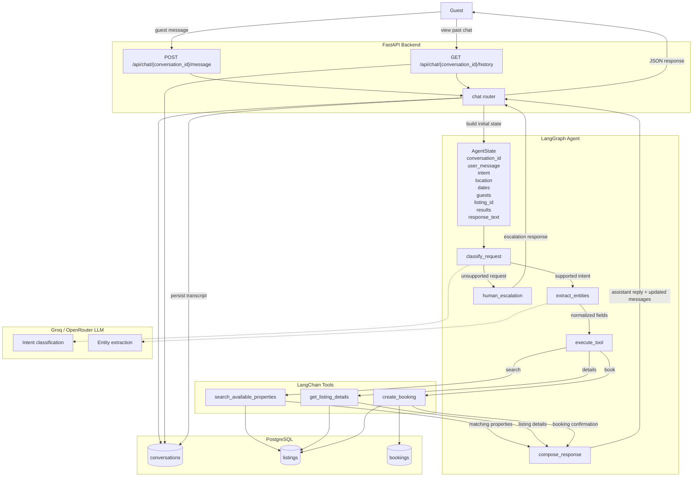

# StayEase AI Agent

## 1. System Overview

StayEase AI Agent is an AI assistant for a rental platform in Bangladesh. It accepts guest messages through a FastAPI backend, uses an LLM through Groq to classify intent and extract booking data, calls a limited set of property and booking tools, and stores conversation data in PostgreSQL. The agent only handles three supported actions: property search, listing details, and booking creation. Any other request is escalated to a human agent.



## 2. Conversation Flow

Example message: "I need a room in Cox's Bazar from 2026-05-10 to 2026-05-12 for 2 guests."

1. The guest sends the message to `POST /api/chat/{conversation_id}/message`.
2. FastAPI creates the initial graph state with `conversation_id`, `user_message`, and empty extracted fields.
3. The `classify_request` node determines that the guest intent is `search`.
4. The `extract_entities` node extracts:
   - `location = "Cox's Bazar"`
   - `check_in_date = "2026-05-10"`
   - `check_out_date = "2026-05-12"`
   - `guests = 2`
5. The extracted values are written into the LangGraph state so the search tool has all required inputs.
6. The `execute_tool` node calls `search_available_properties`.
7. The search tool queries PostgreSQL in a production system and returns matching listings with `listing_id`, title, location, capacity, and BDT nightly price.
8. The `compose_response` node formats a guest-facing reply such as:
   - "I found 2 available properties in Cox's Bazar: Sea View Apartment for BDT 4,500/night and Coral Reef Studio for BDT 3,800/night."
9. FastAPI returns the final response to the guest. In a production implementation, the API would also store both the guest message and assistant reply in the `conversations` table.

## 3. LangGraph State Design

| Field | Type | Why it is needed |
| --- | --- | --- |
| `conversation_id` | `str` | Links the turn to a single conversation record. |
| `user_message` | `str` | Holds the latest guest message being processed. |
| `intent` | `Literal["search", "details", "book", "human_escalation"] \| None` | Determines which tool path the graph should follow. |
| `location` | `str \| None` | Needed to search listings in a destination. |
| `check_in_date` | `str \| None` | Needed to check availability and pricing. |
| `check_out_date` | `str \| None` | Needed to compute stay length and availability. |
| `guests` | `int \| None` | Filters listings by supported guest count. |
| `listing_id` | `int \| None` | Identifies the listing for details or booking flows. |
| `available_properties` | `list[ListingSummary]` | Stores search results returned by the search tool. |
| `listing_details` | `ListingDetails \| None` | Stores the selected listing's details. |
| `booking_result` | `BookingResult \| None` | Stores booking confirmation data. |
| `messages` | `list[ConversationMessage]` | Preserves turn history for the history endpoint. |
| `response_text` | `str \| None` | Holds the final assistant reply returned to the API. |
| `error` | `str \| None` | Captures tool or validation failures. |

## 4. Node Design

### `classify_request`
- What it does: Classifies the guest message as `search`, `details`, `book`, or `human_escalation`.
- Updates in state: `intent`
- Next node: `extract_entities` for supported intents, otherwise `human_escalation`

### `extract_entities`
- What it does: Pulls location, dates, guest count, and listing ID from the guest message.
- Updates in state: `location`, `check_in_date`, `check_out_date`, `guests`, `listing_id`, `error`
- Next node: `execute_tool`

### `execute_tool`
- What it does: Calls one of the three supported tools based on `intent`.
- Updates in state: `available_properties` or `listing_details` or `booking_result`, and optionally `error`
- Next node: `compose_response`

### `compose_response`
- What it does: Builds the final response from the tool output.
- Updates in state: `response_text`, `messages`
- Next node: `END`

### `human_escalation`
- What it does: Returns a polite escalation response for unsupported requests.
- Updates in state: `response_text`, `messages`
- Next node: `END`

## 5. Tool Definitions

### `search_available_properties`
- Input parameters:
  - `location: str`
  - `check_in_date: str`
  - `check_out_date: str`
  - `guests: int`
- Output format:
  - `list[ListingSummary]`
- When the agent uses it:
  - When the guest asks for available properties for a destination, date range, and guest count.

### `get_listing_details`
- Input parameters:
  - `listing_id: int`
- Output format:
  - `ListingDetails`
- When the agent uses it:
  - When the guest asks for more information about a specific property.

### `create_booking`
- Input parameters:
  - `conversation_id: str`
  - `listing_id: int`
  - `check_in_date: str`
  - `check_out_date: str`
  - `guests: int`
- Output format:
  - `BookingResult`
- When the agent uses it:
  - When the guest confirms they want to book a specific listing.

## 6. Database Schema Design


### `listings`

| Column | Type |
| --- | --- |
| `id` | `SERIAL PRIMARY KEY` |
| `title` | `VARCHAR(255) NOT NULL` |
| `location` | `VARCHAR(150) NOT NULL` |
| `description` | `TEXT NOT NULL` |
| `price_per_night_bdt` | `NUMERIC(10,2) NOT NULL` |
| `max_guests` | `INTEGER NOT NULL` |
| `amenities` | `TEXT[] NOT NULL DEFAULT '{}'` |
| `is_active` | `BOOLEAN NOT NULL DEFAULT TRUE` |
| `created_at` | `TIMESTAMP NOT NULL DEFAULT CURRENT_TIMESTAMP` |

### `bookings`

| Column | Type |
| --- | --- |
| `id` | `SERIAL PRIMARY KEY` |
| `conversation_id` | `UUID NOT NULL REFERENCES conversations(id)` |
| `listing_id` | `INTEGER NOT NULL REFERENCES listings(id)` |
| `check_in_date` | `DATE NOT NULL` |
| `check_out_date` | `DATE NOT NULL` |
| `guests` | `INTEGER NOT NULL` |
| `status` | `VARCHAR(30) NOT NULL DEFAULT 'confirmed'` |
| `total_price_bdt` | `NUMERIC(10,2) NOT NULL` |
| `created_at` | `TIMESTAMP NOT NULL DEFAULT CURRENT_TIMESTAMP` |

### `conversations`

| Column | Type |
| --- | --- |
| `id` | `UUID PRIMARY KEY` |
| `messages` | `JSONB NOT NULL DEFAULT '[]'::jsonb` |
| `last_intent` | `VARCHAR(30)` |
| `created_at` | `TIMESTAMP NOT NULL DEFAULT CURRENT_TIMESTAMP` |
| `updated_at` | `TIMESTAMP NOT NULL DEFAULT CURRENT_TIMESTAMP` |

`messages` stores the chat transcript so `GET /api/chat/{conversation_id}/history` can be served without adding a fourth table.

## 7. Project Structure

```text
rental-ai-agent/
├── README.md
├── api.md
├── agent/
│   ├── __init__.py
│   ├── state.py
│   ├── tools.py
│   ├── nodes.py
│   └── graph.py
├── app/
│   ├── __init__.py
│   ├── main.py
│   └── routes/
│       ├── __init__.py
│       └── chat.py
├── schemas/
│   ├── __init__.py
│   └── chat.py
└── sql/
│    └── schema.sql
└── Junior AI Engineer — One Day Take-Home Test.pdf
```
